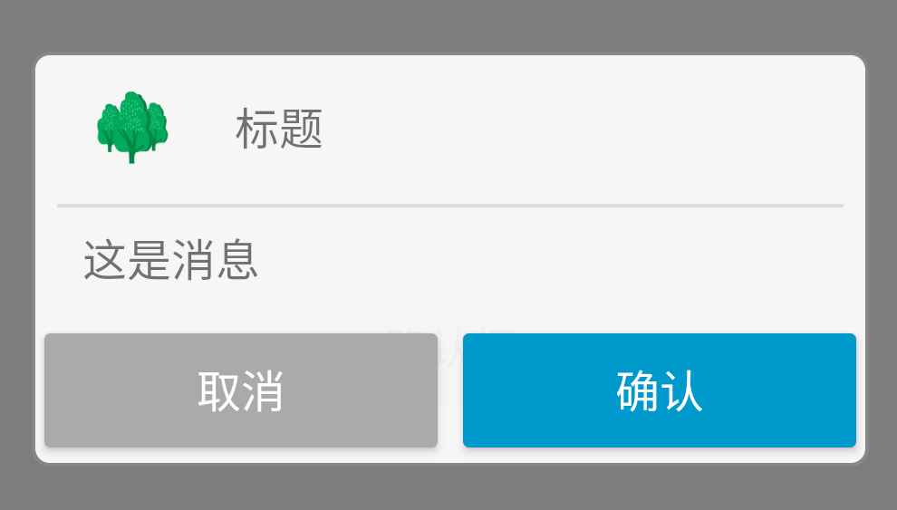

# SlinDialog

封装了一个通用的DialogFragment。

使用方式：
```java
ConfirmDialogViewHolder viewHolder = new ConfirmDialogViewHolder.Builder()
        .msg("这是消息")
        .title("标题")
        .confirmText("确认")
        .cancelText("取消")
        .icon(getDrawable(R.drawable.slin))
        .confirmListener(((view1, dialog) -> {
            Toast.makeText(this, "确认", Toast.LENGTH_SHORT).show();
            dialog.dismiss();
        }))
        .build();
SlinDialog.showDialog(getSupportFragmentManager(), viewHolder);
```
效果图：


如果你想使用其他界面，只需要继承DialogViewHolder设置新的界面
